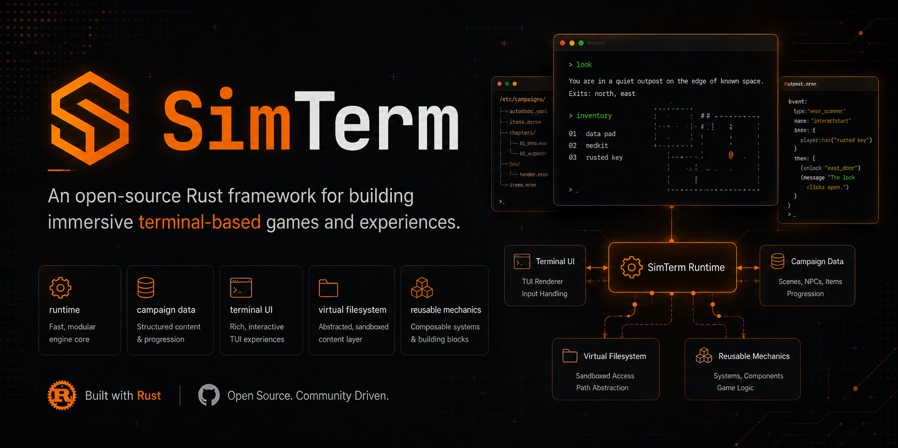

# SimTerm

SimTerm is an open-source framework for building immersive terminal-based games
and experiences.

> A framework for building immersive terminal-based games and experiences.

It provides a reusable Rust runtime, terminal frontend, campaign data model, and
content-loading pipeline for interactive command-driven experiences. The sample
campaign uses a simulated hacking loop, but the framework is meant to support
any fiction or system that benefits from a rich terminal interface.

The framework does not include a built-in story. Missions, scenes, commands,
entities, narrative text, endings, branding, and cosmetic flavor live in
external campaign files that can be loaded without recompiling.

```text
simterm-engine (library) + experience data (.ron) -> simterm terminal experience
```

## Features

- Terminal UI built with `ratatui` and `crossterm`.
- Reusable Rust runtime crate with no UI dependency.
- External campaigns and experiences written in RON.
- Command-driven runtime with phases, state transitions, trace pressure,
  branching outcomes, logs, and campaign-defined flavor.
- Generic content boundaries: framework mechanics stay in Rust, while story,
  targets, entities, files, objectives, UI text, and endings live in data.
- Virtual filesystem support for terminal-native exploration, clues, rewards,
  and objectives.
- Neutral sample campaign for testing and modding. It demonstrates a simulated
  hacking scenario, not the limit of the framework.

## Requirements

- Rust stable, edition 2021. Install it from <https://rustup.rs/>.

## Quick Start

Run the bundled sample campaign:

```bash
cargo run -p simterm
```

Run a specific campaign directory or `.ron` file:

```bash
cargo run -p simterm -- --campaign ./examples/sample_campaign
cargo run -p simterm -- ./examples/sample_campaign/campaign.ron
```

Validate a campaign without opening the TUI:

```bash
cargo run -p simterm -- --check --campaign ./examples/sample_campaign
```

If no campaign path is provided, SimTerm loads `examples/sample_campaign`.

Run a visible automated playthrough:

```bash
cargo run -p simterm -- --campaign ./examples/sample_campaign --autoplay
```

Run the stricter deterministic autoplayer:

```bash
cargo run -p simterm -- --campaign ./examples/sample_campaign --autoplay-deterministic
```

`--autoplay` opens the normal TUI and injects real commands with visible pauses,
so it is useful as an end-to-end playability check. `--autoplay-deterministic`
avoids `Unstable` exploits and will not use probabilistic privilege escalation;
if no deterministic route is available, it stops and writes that reason to the
log. Use `--autoplay-delay <ms>` to slow down or speed up the command cadence.

## Sample Experience Commands

The bundled sample campaign demonstrates a terminal hacking experience. Its
core command flow is:

- `target` - show the current target.
- `nmap` - active reconnaissance.
- `sniff` - passive service discovery.
- `connect` - establish a gateway connection for pivot-entry missions.
- `probe`, `nikto`, `gobuster`, `enum4linux`, `hydra`, `sqlmap <port>` -
  enumerate discovered services.
- `intel` - list findings.
- `searchsploit <id>` or `verify <id>` - research a finding.
- `exploit <id>` - attempt exploitation.
- `login` - use a reusable credential token when the host accepts it.
- `privesc` - attempt local privilege escalation.
- `loot` - show collected credentials and notes.
- `netmap` and `pivot <host>` - move through multi-host networks.
- `ls`, `cd`, `pwd`, `cat`, `find`, `whoami` - explore the post-exploitation
  virtual filesystem.
- `cleanup` - reduce trace at a cost.
- `status`, `logs`, `logros`, `clear`, `reset`, `quit` - manage the session.
- `choose <n>` - select an ending when the final mission offers choices.

Campaigns may also define harmless hidden commands as easter eggs.

## Achievements

The runtime tracks generic achievements during a campaign:

- first foothold,
- first root shell,
- first useful loot,
- first lateral pivot,
- clean operation under 25% trace,
- campaign complete.

Campaigns can also declare their own achievements in `campaign.ron` with
data-driven triggers such as `ReadFile`, `CompleteMission`, `ChooseEnding`, and
`CampaignComplete`. See [Campaign Format](docs/CAMPAIGN_FORMAT.md).

Use `logros` in the TUI to list unlocked and pending engine and campaign
achievements. The English aliases `achievements` and `achievement` also work.
Achievements are stored with campaign progress and cleared by `reset`.

## Creating Experiences

A SimTerm experience is packaged as a campaign. It can be either:

- a directory containing `campaign.ron`, or
- a direct path to a `.ron` file containing a `Campaign`.

Start from the sample:

```bash
cp -r examples/sample_campaign campaigns/my_campaign
cargo run -p simterm -- --check --campaign ./campaigns/my_campaign
cargo run -p simterm -- --campaign ./campaigns/my_campaign
```

See:

- [Campaign Format](docs/CAMPAIGN_FORMAT.md) for the complete public data
  reference.
- [Modding Guide](docs/MODDING.md) for a practical campaign-building workflow.
- [Command Surface](docs/COMMANDS.md) for the commands campaigns can emulate
  today.
- [Architecture](docs/ARCHITECTURE.md) for engine and frontend boundaries.

Private or commercial experiences should be distributed separately from this
repository. The framework loads them at runtime, but they are not part of this
open-source project.

## Development

```bash
cargo build
cargo test
cargo clippy
```

Repository layout:

```text
crates/
  engine/            simterm-engine: campaign model, loader, runtime rules
  simterm/          terminal frontend and CLI
docs/                public documentation
examples/
  sample_campaign/   public fictional campaign used for tests and examples
campaigns/           local campaign workspace
```

Contribution rules:

- Keep experience-specific content out of the engine and frontend code.
- New mechanics should be expressible as campaign data with neutral defaults.
- Keep sample content fictional and safe to publish.
- Do not commit private campaign documentation or proprietary story material.

## License

Framework, frontend, public sample campaign, and public documentation are
licensed under the MIT License. See [LICENSE](LICENSE).

Campaigns distributed separately may use their own licenses.
